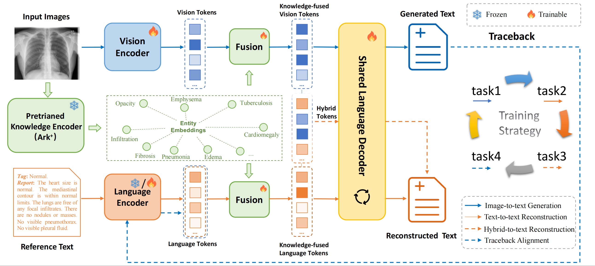

# CyclicAligner

## Abstract

To reduce the diagnostic burden on radiologists, recent studies have explored automatic chest X-ray (CXR) report generation via artificial intelligence. Yet, achieving robust cross-modal alignment between medical images and textual reports remains a major challenge. In this paper, we propose **CyclicAligner**, a knowledge-enhanced cyclical alignment framework for CXR report generation.

CyclicAligner adopts a novel cyclical training paradigm with four tightly coupled tasks to effectively learn cross-modal semantic alignment:

1. **Image-to-text generation task:** aligns visual semantics with clinical findings.  
2. **Text-to-text reconstruction task:** strengthens language modeling.  
3. **Hybrid-to-text reconstruction task:** mixes vision and language tokens for text reconstruction.  
4. **Traceback alignment task:** re-encodes texts generated by the image-to-text branch for text reconstruction and aligns the reconstructed text with the reference.

To further enhance cross-modal understanding, we integrate domain-specific medical entity knowledge extracted from a pre-trained encoder to enrich both vision and language tokens. Moreover, CyclicAligner jointly predicts medical tags and narrative reports within a unified auto-regressive pipeline, where the tags serve as auxiliary semantic anchors that guide the report generation. Extensive experiments on public datasets demonstrate the effectiveness of our method for clinically coherent CXR report generation.

---

## Overall Framework of CyclicAligner



---

## Datasets

- **MIMIC-CXR:**  
  Please download from https://physionet.org/content/mimic-cxr-jpg/2.0.0/ with your account being *credentialed*.

- **IU X-Ray:**  
  Please download from https://openi.nlm.nih.gov/.

---

## Environment and Installation

**Python:** `3.9.23`  
**PyTorch:** `2.7.1+cu126`

Install dependencies:

```bash
pip install -r requirements.txt
```